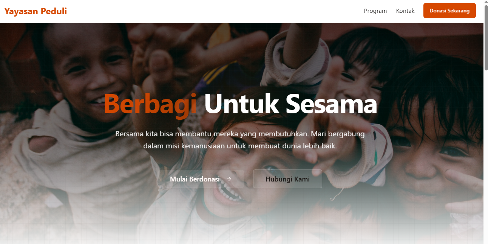
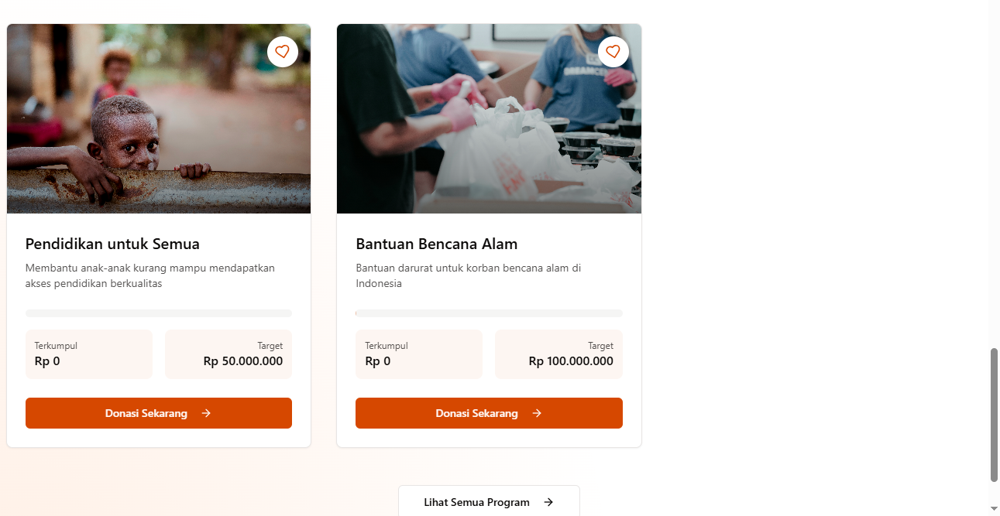
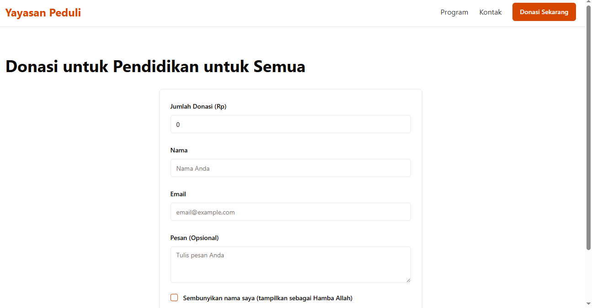

# Yayasan Peduli - Platform Donasi Online

Platform donasi dan sedekah berbasis web untuk yayasan menggunakan React dan Express. Memungkinkan pengguna untuk berdonasi ke berbagai program bantuan dengan mudah dan transparan.








## 🚀 Teknologi

- **Frontend**: React, TanStack Query, Tailwind CSS, shadcn/ui
- **Backend**: Express.js
- **Database**: PostgreSQL dengan Drizzle ORM
- **Validasi**: Zod
- **Routing**: Wouter

## ✨ Fitur Utama

- 📱 Tampilan responsif untuk desktop dan mobile
- 💳 Donasi online yang aman dan mudah
- 📊 Transparansi penggunaan dana
- 📬 Form kontak untuk komunikasi
- 🔄 Update real-time progress donasi

## 🛠️ Instalasi & Penggunaan

1. Clone repositori
```bash
git clone <repository-url>
```

2. Install dependensi
```bash
npm install
```

3. Jalankan aplikasi
```bash
npm run dev
```

Aplikasi akan berjalan di `http://localhost:5000`

## 📋 Fitur yang Akan Datang

- [ ] Integrasi payment gateway
- [ ] Dashboard admin untuk manajemen kampanye
- [ ] Generasi bukti donasi
- [ ] Penjadwalan donasi rutin

## 📸 Screenshot

### Halaman Utama


### Program Bantuan


## 📝 Lisensi

MIT License - Lihat [LICENSE](LICENSE) untuk informasi lebih lanjut.

## 🤝 Kontribusi

Kontribusi, issues, dan feature requests sangat diterima. Silakan buat issue terlebih dahulu untuk diskusi perubahan yang ingin dilakukan. silahkan email habizinnia@gmail.com
jika membutuhkan repo ini
